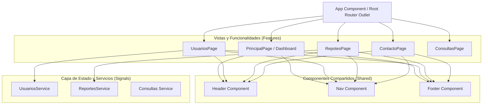

# Documentación Técnica del Proyecto - ConsultasIUB (MiTutoría)

**Versión del Documento:** 1.0.0  
**Fecha:** Octubre 2026  
**Tecnología Base:** Angular 22.2.0, TypeScript 6.0.2, Vite / Angular Build  

---

## 1. Visión General del Proyecto

**Consultas-iub** (identificado en la interfaz como **MiTutoría - Sistema Académico**) es una aplicación web moderna orientada a la gestión académica, seguimiento de consultas estudiantiles, administración de usuarios y generación de reportes institucionales.

### Características Principales de Arquitectura
- **Angular Moderno (v22+):** Basado completamente en **Standalone Components**, eliminando la necesidad de `NgModule`.
- **Reactividad con Signals:** Implementación de `@angular/core` Signals (`signal`, `asReadonly`, `update`) para la gestión de estado reactivo y predecible en los servicios.
- **Control Flow Sintaxis:** Uso de la sintaxis nativa `@for` y `@empty` de Angular en lugar de directivas estructurales heredadas (`*ngFor`).
- **Enrutamiento Perezoso (Lazy Loading):** Carga diferida de vistas y módulos mediante `loadComponent` con imports dinámicos en `app.routes.ts`.
- **Inyección de Dependencias Moderna:** Uso de la función `inject()` de `@angular/core`.

---

## 2. Estructura de Directorios

El proyecto sigue una estructura limpia orientada a funcionalidades (**Feature-Driven Architecture**) y componentes compartidos (**Shared Components**):

```
Consultas-iub/
├── .angular/
├── .vscode/
├── public/
├── src/
│   ├── app/
│   │   ├── features/                      # Módulos funcionales de la aplicación
│   │   │   ├── consultas/                 # Módulo de Consultas (en desarrollo)
│   │   │   │   ├── page/consultas-page/
│   │   │   │   └── services/
│   │   │   ├── contacto/                  # Información institucional y canales de soporte
│   │   │   │   └── page/contacto-page/
│   │   │   ├── principal/                 # Pantalla de inicio / Dashboard
│   │   │   │   └── page/principal-page/
│   │   │   ├── reportes/                  # Módulo de reportes y auditoría
│   │   │   │   ├── model/
│   │   │   │   ├── page/repotes-page/
│   │   │   │   └── services/
│   │   │   └── usuarios/                  # Gestión y visualización de usuarios
│   │   │       ├── page/usuarios-page/
│   │   │       └── services/
│   │   ├── shared/                        # Componentes reutilizables transversales
│   │   │   └── components/
│   │   │       ├── footer/                # Pie de página institucional
│   │   │       ├── header/                # Encabezado principal corporativo
│   │   │       └── nav/                   # Barra de navegación principal
│   │   ├── app.config.ts                  # Proveedores y configuración global
│   │   ├── app.css                        # Estilos específicos del layout raíz
│   │   ├── app.html                       # Router outlet base
│   │   ├── app.routes.ts                  # Definición y mapeo de rutas
│   │   └── app.ts                         # Componente raíz (App)
│   ├── index.html                         # Entrada HTML principal
│   ├── main.ts                            # Bootstrap de la aplicación Angular
│   └── styles.css                         # Estilos globales
├── angular.json                           # Configuración del CLI de Angular
├── package.json                           # Dependencias y scripts
└── tsconfig.json                          # Configuración de TypeScript
```

---

## 3. Diagrama de Arquitectura y Componentes



---

## 4. Detalle de Módulos y Componentes

### 4.1. Componentes Globales Compartidos (`src/app/shared/components`)

1. **Header (`Header`)**
   - **Ubicación:** `src/app/shared/components/header/`
   - **Función:** Cabecera institucional con título `"MiTutoria"` y subtítulo descriptivo.
   - **Estilo:** Gradiente azul oscuro (`#1f3864` a `#16294a`), tipografía en blanco y texto secundario gris claro (`#d1d5db`).

2. **Nav (`Nav`)**
   - **Ubicación:** `src/app/shared/components/nav/`
   - **Función:** Barra horizontal de enlaces de navegación con detección automática de ruta activa (`routerLinkActive="activo"`).
   - **Rutas configuradas en el menú:**
     - `/principal`
     - `/usuarios`
     - `/contacto`
     - `/consultas`
     - `/reportes`

3. **Footer (`Footer`)**
   - **Ubicación:** `src/app/shared/components/footer/`
   - **Función:** Pie de página con indicación de `"Sistema academico"`, compartiendo la misma paleta y gradiente del header.

---

### 4.2. Módulos de Funcionalidad (`src/app/features`)

#### A. Módulo Principal (`principal`)
- **Ruta:** `/principal` (Ruta por defecto al cargar `/` y para comodín `/**`).
- **Componente:** `PrincipalPage` (`src/app/features/principal/page/principal-page/principal-page.ts`).
- **Función:** Pantalla de aterrizaje (Landing) que da la bienvenida a la plataforma con un contenedor centrado: `"BIENVENIDOS A MiTutoria: Gestiona tus consultas de manera eficiente"`.

#### B. Módulo de Usuarios (`usuarios`)
- **Ruta:** `/usuarios`
- **Componente:** `UsuariosPage` (`src/app/features/usuarios/page/usuarios-page/usuarios-page.ts`).
- **Servicio:** `UsuariosService` (`src/app/features/usuarios/services/usuarios.ts`).
- **Modelo:**
  ```typescript
  export interface Usuario {
    id: number;
    nombre: string;
    email: string;
  }
  ```
- **Lógica y Reactividad:**
  - El servicio mantiene un estado reactivo privado mediante un `signal<Usuario[]>` precargado con datos iniciales.
  - Expone una señal de solo lectura `usuarios = this._usuarios.asReadonly()`.
  - Dispone del método `agregarUsuario(usuario: Usuario): void` mediante `update()`.
- **Diseño de Interfaz:**
  - Tarjeta estilizada con sombra suave y esquinas redondeadas (`12px`).
  - Contador dinámico en badge (`Total: X usuarios registrados`).
  - Tabla con cabecera oscura (`#16294a`), filas alternadas con hover interactivo y soporte de estado vacío (`@empty`).

#### C. Módulo de Reportes (`reportes`)
- **Ruta:** `/reportes`
- **Componente:** `RepotesPage` (`src/app/features/reportes/page/repotes-page/repotes-page.ts`).
- **Servicio:** `ReportesService` (`src/app/features/reportes/services/reportes.ts`).
- **Modelo:** `Reporte` (`src/app/features/reportes/model/reportes.model.ts`):
  ```typescript
  export interface Reporte {
    id: number;
    titulo: string;
    tipo: string;
    fecha: string;
    estado: 'Completado' | 'Pendiente';
  }
  ```
- **Lógica y Reactividad:**
  - Mantiene `reportesSignal = signal<Reporte[]>` con registros de asistencias, solicitudes PQRS y evaluaciones de desempeño.
  - Expone la señal pública `reportes`.
- **Diseño de Interfaz:**
  - Botón de acción con estilo píldora para `"Generar Reporte"`.
  - Tabla detallada con columnas: ID, Título del Reporte, Tipo, Fecha, Estado y Acciones.
  - Insignias de estado con estilos condicionales:
    - `Completado`: Fondo verde pastel (`#d1fae5`) y texto verde bosque (`#065f46`).
    - `Pendiente`: Fondo amarillo/ámbar (`#fef3c7`) y texto marrón (`#92400e`).
  - Botones circulares de acción rápida para previsualizar y descargar PDF.

#### D. Módulo de Contacto (`contacto`)
- **Ruta:** `/contacto`
- **Componente:** `ContactoPage` (`src/app/features/contacto/page/contacto-page/contacto-page.ts`).
- **Función:** Tarjeta centrada con sombra y efecto hover interactivo mostrando los canales de atención institucional (correo electrónico y línea telefónica).

#### E. Módulo de Consultas (`consultas`)
- **Componente:** `ConsultasPage` (`src/app/features/consultas/page/consultas-page/consultas-page.ts`).
- **Servicio:** `Consultas` (`src/app/features/consultas/services/consultas.ts`).
- **Estado Actual:** En fase de scaffolding/esqueleto inicial.

---

## 5. Tabla de Rutas de la Aplicación

| Path | Componente Cargado (Lazy) | Descripción |
| :--- | :--- | :--- |
| `""` | Redirección a `/principal` | Ruta raíz inicial |
| `"/principal"` | `PrincipalPage` | Página de inicio y bienvenida |
| `"/usuarios"` | `UsuariosPage` | Lista de usuarios registrados |
| `"/contacto"` | `ContactoPage` | Información de contacto y soporte |
| `"/reportes"` | `RepotesPage` | Módulo de reportes y PQRS |
| `"/consultas"` | *(Pendiente de enlazar en routes)* | Módulo de consultas |
| `"**"` | Redirección a `/principal` | Comodín para URLs no encontradas |

---

## 6. Sistema de Diseño y Paleta de Colores

La aplicación utiliza un sistema visual corporativo cohesivo basado en tonos azules marinos y acentos modernos:

| Rol / Elemento | Código Hexadecimal | Propósito |
| :--- | :--- | :--- |
| **Primario Oscuro** | `#1F3864` | Encabezados, títulos, botones principales y degradados |
| **Azul Profundo** | `#16294a` | Fondo de navegación, cabeceras de tablas (`thead`) |
| **Énfasis / Acento** | `#0d6efd` | Enlaces activos de navegación y líneas divisorias |
| **Fondo de Página** | `#f0f4f8` / `#f8f9fa` | Contraste suave para paneles y tarjetas |
| **Tarjetas** | `#ffffff` | Superficie blanca con borde tenue `#d9e2ec` |
| **Texto Principal** | `#243b53` / `#212529` | Textos de alto contraste y legibilidad |
| **Badge Completado**| `#d1fae5` / `#065f46` | Estado positivo de reportes |
| **Badge Pendiente** | `#fef3c7` / `#92400e` | Estado en espera de reportes |

---

## 7. Dependencias y Herramientas

- **Angular Core & CLI:** `v22.2.0`
- **Enrutamiento:** `@angular/router`
- **Manejo de Formularios:** `@angular/forms`
- **Compilador y Bundler:** `@angular/build` (Vite integrado)
- **Lenguaje:** TypeScript `~6.0.2`
- **Pruebas Unitarias:** Vitest `^5.0.0`
- **Linter y Formateador:** Prettier `^3.8.1`

---

## 8. Guía de Ejecución y Desarrollo

### Servidor Local de Desarrollo
```bash
npm start
# O alternativamente:
ng serve
```
La aplicación quedará disponible en `http://localhost:4200/` con recarga automática en vivo (*live reload*).

### Compilación para Producción
```bash
npm run build
```
Genera los bundles optimizados en el directorio `dist/Consultas-iub`.

### Ejecución de Pruebas Unitarias
```bash
npm test
```
Ejecuta las suites de pruebas con el motor Vitest.

---

## 9. Observaciones Técnicas y Recomendaciones de Mejora

1. **Ruta `/consultas`:**  
   El enlace `/consultas` ya existe en el menú de navegación (`src/app/shared/components/nav/nav.html`), pero actualmente no está registrado en `src/app/app.routes.ts`. Se recomienda agregarlo:
   ```typescript
   {
     path: "consultas",
     loadComponent: () =>
       import("./features/consultas/page/consultas-page/consultas-page")
         .then(m => m.ConsultasPage)
   }
   ```

2. **Decorador en `ConsultasService`:**  
   En `src/app/features/consultas/services/consultas.ts`, se encuentra `@Service()` que no es parte del estándar de Angular, en lugar de:
   ```typescript
   import { Injectable } from '@angular/core';

   @Injectable({
     providedIn: 'root'
   })
   export class ConsultasService { ... }
   ```

3. **Corrección tipográfica en carpeta de Reportes:**  
   La carpeta de página se llama actualmente `repotes-page` y su componente `RepotesPage` (falta la "r"). Se recomienda refactorizar a `reportes-page` y `ReportesPage` para consistencia.

4. **Detalle estético en `footer.html`:**  
   En la primera línea de `src/app/shared/components/footer/footer.html`, aparece la etiqueta residual `<p>footer works!</p>` por encima del `<footer class="footer">`. Se sugiere eliminarla para pulir la apariencia.

5. **Librería de Íconos:**  
   En `repotes-page.html` se emplean clases como `bi bi-eye`, `bi bi-download` y `bi bi-file-earmark-plus`. Para que se visualicen correctamente, se recomienda asegurar la inclusión de Bootstrap Icons vía CDN o npm (`bootstrap-icons`).
